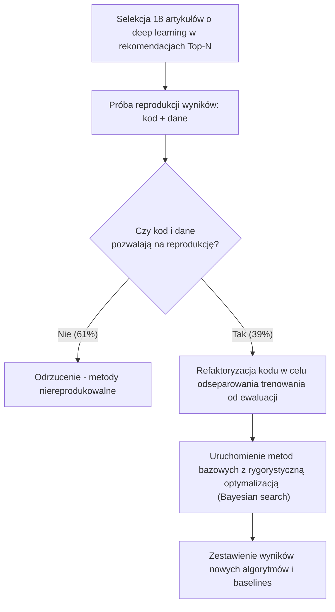

# Are We Really Making Much Progress? A Worrying Analysis of Recent Neural Recommendation Approaches (2019)
**Autorzy:** Maurizio Ferrari Dacrema, Paolo Cremonesi, Dietmar Jannach

## 1. O czym jest tekst (Główny temat i myśli przewodnie)
Artykuł stanowi wnikliwą analizę postępu osiągniętego w obszarze systemów rekomendacyjnych (Top-N recommendation), bazujących na technikach głębokiego uczenia (deep learning). Autorzy podają w wątpliwość doniesienia o ogromnym postępie i badają problem braku reprodukowalności wyników oraz tendencję do porównywania nowych algorytmów z niesłusznie zoptymalizowanymi (tzw. "weak baselines") lub zbyt prostymi metodami bazowymi. Wskazują zjawisko **"phantom progress"** (pozornego postępu).

## 2. Problem i Cel Badawczy
1. **Reprodukowalność (Reproducibility):** W jakim stopniu ostatnie publikacje naukowe z zakresu deep learning w systemach rekomendacyjnych są reprodukowalne (czy dają się powtórzyć przy relatywnie niedużym wysiłku na podstawie udostępnionych kodów i danych)?
2. **Prawdziwy Postęp (Progress):** W jakim stopniu nowe algorytmy faktycznie osiągają lepsze wyniki w porównaniu do stosunkowo prostych, ale **dobrze nastrojonych (well-tuned)** klasycznych metod bazowych?

## 3. Metodologia
Autorzy przeprowadzili systematyczny przegląd 18 długich artykułów naukowych opublikowanych w latach 2015-2018 na wiodących konferencjach (KDD, SIGIR, TheWebConf/WWW, RecSys).

**Schemat działania:**

Do porównań użyto klasycznych metod (baselines):
- **TopPopular:** metoda niepersonalizowana, polecająca po prostu najpopularniejsze przedmioty.
- **ItemKNN / UserKNN:** tradycyjne podejścia Collaborative Filtering (CF).
- **ItemKNN-CBF / ItemKNN-CFCBF:** metody oparte na treści i hybrydowe.
- **P3α / RP3β:** proste algorytmy grafowe symulujące spacer losowy.

## 4. Wyniki Eksperymentów
### Analiza reprodukowalności
Z 18 wytypowanych publikacji zaledwie **7 metod (ok. 39%) udało się zreprodukować** w racjonalnym czasie na podstawie dostarczonych danych (w tym poprawnego podziału na test i train) oraz działającego kodu.

### Wyniki starcia z metodami bazowymi (Tuning baselines)
Gdy porównano 7 "dobrych" zreprodukowanych podejść z odpowiednio zoptymalizowanymi klasycznymi algorytmami, okazało się, że **w 6 przypadkach sieci neuronowe nie dawały lepszych wyników**.

| Nowoczesny Algorytm DL | Wynik po starciu z wyżyłowanymi metodami tradycyjnymi |
| :--- | :--- |
| **CMN** (Collaborative Memory Networks) | Przegrywa w większości z klasycznymi algorytmami personalizowanymi; w jednym zbiorze danych (Epinions) najlepszy okazał się trywialny `TopPopular`. |
| **MCRec** (Metapath based Context for Rec) | Tradycyjny `ItemKNN`, po odpowiedniej konfiguracji, wygrywa ze wszystkimi metrykami. |
| **CVAE / CDL** (Variational Autoencoders / Collaborative DL) | `ItemKNN` oraz metody hybrydowe przewyższają modele dla krótkich list rekomendacji (np. Top-50). Zwyciężają jedynie dla mało realnych progów (listy powyżej 100 rekomendacji). |
| **NCF** (Neural Collaborative Filtering) | O ile bije prostsze baseliny na jednym zbiorze, o tyle przy porównaniu z metodą liniową (SLIM) wypada słabiej. |
| **SpectralCF** (Spectral Collaborative Filtering) | Wykryto ewidentne błędy w zrównoważeniu podziałów train/test oryginalnych autorów (popularność zbioru testowego była nienaturalna). Na poprawnych podziałach przegrywa nawet z `TopPopular`. |
| **Mult-VAE** | **Jedyny model** systematycznie przewyższający prostsze rozwiązania bazowe o 10-20% w metryce Recall (choć niekoniecznie w NDCG, gdy zoptymalizuje się do tego metodę SLIM). |

## 5. Najważniejsze Wnioski (Takeaways)
* **Zjawisko "Phantom Progress":** Iluzja gwałtownego postępu w rekomendacjach opartych o deep learning wynika ze zjawiska "weak baselines". Nowe algorytmy wydają się wybitne tylko dlatego, że porównuje się je ze źle zoptymalizowanymi metodami tradycyjnymi lub z innymi (niedopracowanymi) sieciami neuronowymi.
* **Brak ustandaryzowanej metodologii:** Istnieje wielka dowolność w podziałach danych (niektóre błędy podziałów jawnie fałszują wyniki jak w SpectralCF) i w doborze metryk pod publikację.
* **Proste znaczy lepsze:** W przeważającej liczbie przypadków (6 na 7 testowanych modeli) po porządnej optymalizacji (tuning hiperparametrów), stare proste metody np. KNN lub modele losowe na grafach wykazują lepszą skuteczność i są o rzędy wielkości tańsze obliczeniowo od skomplikowanych modeli głębokiego uczenia.
